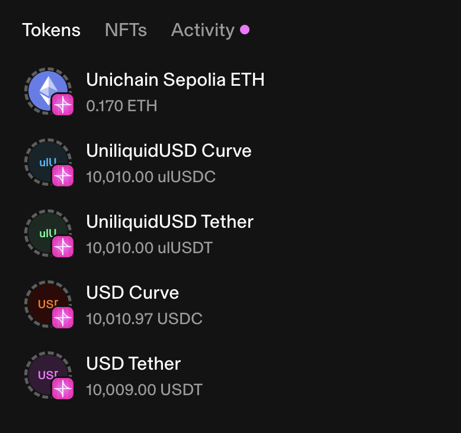

# Uniliquid Hook


## Table of Contents

- [Introduction](#introduction)
- [Testnet Deployments](#testnet-deployments)
  - [Unichain Sepolia](#unichain-sepolia)
- [Docs](#docs)
- [Prerequisites](#prerequisites)
- [Running Tests](#running-tests)
- [Deploying the Hook](#deploying-the-hook)
- [Future Tasks](#future-tasks)

## Introduction

This is a hook for Uniswap V4 that allows LPs to liquidize their liquidity deposited into stablecoin-to-stablecoin pools. These liquid tokens are called "Uniliquids". The objective of this hook is to provide a way for LPs to provide liquidity to stablecoin-to-stablecoin pools, earning the yield, without losing the access to their liquidity.

Example: if a user deposits 1000 USDC into the pool, the hook will mint a uniliquid USDC (`1000 ulUSDC`) token to this user.

Uniliquids are ERC20 tokens that are pegged to the stablecoin in the pool, thus essentially preserving LPs' liquidity. The price of the uniliquid token is determined by the price of the stablecoin in the pool.

Uniliquids are minted in the ratio of 1:1 with the stablecoin in the pool.

## Testnet Deployments

### Unichain Sepolia

Deployment artifacts:

- Hook: `0xa1bda7ca8b5b9c08c4942e0b43ccf26a70206a88` ([Explorer](https://unichain-sepolia.blockscout.com/address/0xa1bda7ca8b5b9c08c4942e0b43ccf26a70206a88))
- Mock USDC: `0xdba72418a27113bb4f2f351b9341f8d650ffa08a` ([Explorer](https://unichain-sepolia.blockscout.com/token/0xdba72418a27113bb4f2f351b9341f8d650ffa08a))
- Mock USDT: `0x65a546448393872bb56aa74931afef34ded45514` ([Explorer](https://unichain-sepolia.blockscout.com/token/0x65a546448393872bb56aa74931afef34ded45514))
- Uniliquid USDC / USDC (see `tokens` section): [Explorer](https://unichain-sepolia.blockscout.com/address/0x2767D3d7A6A266CEEA60C6f603E114F95476D8bB?tab=tokens)
- Swap Example: [Explorer](https://unichain-sepolia.blockscout.com/tx/0x1f31c5b109eb4b0fe365bdaccdfe88988eb27609f8421dd844d3287ec8f63e5d)

A more detailed artifacts can be found in the `broadcast-sepolia` folder.

Example wallet with Uniliquids:

<div align="left">
  
</div>

## Docs

- [Motivation](docs/00_Motivation.md)
- [Custom Curve](docs/01_CFMM.md)
- [Contract Overview](docs/02_Contract_Overview.md)

## Prerequisites

- [Foundry](https://getfoundry.sh/)

## Running Tests

To run the tests, run the following command:

```bash
make test
```

## Deployment Scripts

### Deploying the Hook

To deploy the hook, run the following commands:

1. Set the required `.env` variables. The list can be found in the `example.env` file.
2. (Optional) Deploy the mock tokens with `make deploy-mock-tokens`. Set the contract addresses of the deployed tokens in the `script/base/Config.sol` file.
3. (Optional) Set the contract addresses for the `PoolManager` and `PositionManager` in the `script/base/Constants.sol` file.
4. Deploy the hook with `make deploy-hook`.
5. Set the contract address of the deployed hook in the `script/base/Config.sol` file.

### Funding the Sender (Optional)

To fund the sender with testnet USDC and USDT on Unichain Sepolia, run the following command:

```bash
make fund-me
```

### Creating the Pool with Initial Liquidity

To create the pool with initial liquidity, run the following command:

```bash
make deploy-pool-with-initial-liquidity
```

### Adding More Liquidity

To add even more liquidity to the pool, run the following commands:

```bash
make add-liquidity
```

### Basic Swap

To perform a basic swap, run the following command:

```bash
make swap
```

This will perform a swap of 1 USDC to USDT. If you wish to configure the swap amount, you can do so by changing the `amountSpecified` value in the `script/03_Swap.s.sol` file.

## Future Tasks

- [ ] Add support for exact out swaps.
- [ ] Add support for single-asset deposits/redemptions.
